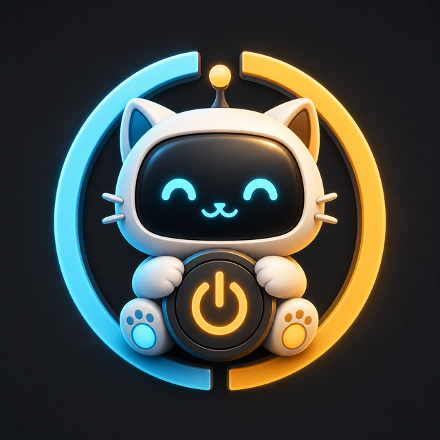
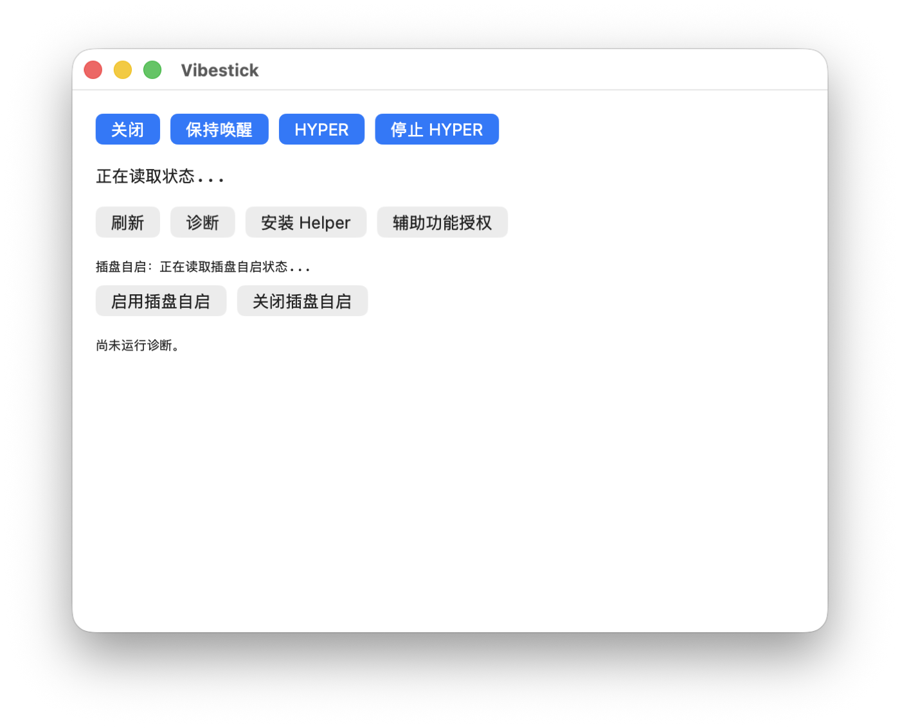

<p align="center">
  
</p>

<h1 align="center">Vibestick</h1>

<p align="center">
  A desktop sleep-policy key with a coder-aware desktop pet for Windows and macOS.
</p>

<p align="center">
  <a href="README.md">English</a> · <a href="README.zh-CN.md">中文</a>
</p>

<p align="center">
  <a href="https://github.com/pzy2000/Vibestick/actions/workflows/ci.yml"></a>
  <a href="https://github.com/pzy2000/Vibestick/stargazers"></a>
  <a href="https://github.com/pzy2000/Vibestick/releases"></a>
  <a href="https://github.com/pzy2000/Vibestick/releases"></a>
  
  
  
  
</p>

Vibestick keeps your laptop awake when long-running work matters, restores the
original power policy when you are done, and turns local coder activity into a
small desktop companion you can keep in peripheral vision.

## Screenshots

| macOS control panel | Coder-aware desktop pet |
| --- | --- |
|  |  |

The screenshots are captured from the native macOS app with a temporary demo
status directory so no local Codex session, workspace path, or private window
content is published.

## News

- **2026-05-28**: Added GitHub Actions CI for Windows .NET and macOS Swift builds, tests, and macOS dev bundle artifacts.
- **2026-05-28**: Added native macOS DMG packaging, first-launch helper setup, and drag-to-install release flow.
- **2026-05-27**: Added RP2040 device auto-start support through a Windows startup companion and a macOS per-user LaunchAgent watcher.
- **2026-05-19**: Added the floating desktop pet, task cards, and Codex/coder status bridge.

## Features

- **Three sleep modes**: `off` restores policy, `on` keeps the machine awake,
  and `hyper` combines wake priority with battery and coder-task awareness.
- **Native Windows and macOS lines**: Windows lives in `src/` and `tests/`;
  macOS lives in `macos/` with SwiftUI/AppKit, `vibestickctl`, and a privileged
  helper for fixed `pmset` operations.
- **Coder-aware pet**: the desktop pet reads local adapter files and Codex
  session events, then maps active work to moods such as reasoning,
  tool-calling, waiting, success, and error.
- **RP2040 insert-to-launch flow**: a flashed Vibestick board can launch or
  focus the host app while bootloader mode stays a setup/flashing state.
- **Dependency-light Windows MVP**: the .NET projects intentionally avoid
  external NuGet packages, including the console test runner.

## Quick Start

### Windows

Requirements:

- Windows 10/11
- .NET 8 SDK

```powershell
dotnet run --project src/Vibestick.Cli -- status
dotnet run --project src/Vibestick.Cli -- doctor
dotnet run --project src/Vibestick.Cli -- mode on
dotnet run --project src/Vibestick.Cli -- mode hyper
dotnet run --project src/Vibestick.Cli -- mode off
dotnet run --project src/Vibestick.Cli -- revert
```

Start the desktop pet and control panel:

```powershell
.\scripts\vibestick-gui.ps1
```

Use `Ctrl+C` to stop a foreground `mode hyper` guard. `mode hyper --once`
applies the power policy and exits, but cannot keep a sleep assertion after the
process exits.

### macOS

Requirements:

- macOS 14 or newer
- Xcode command line tools with Swift 6-compatible toolchain

```bash
cd macos
swift build
swift test
```

Build a development app bundle:

```bash
scripts/build-release.sh dev
```

Build a development drag-to-install DMG:

```bash
scripts/build-dmg.sh dev
```

For local CLI testing without installing the privileged helper:

```bash
cd macos
export VIBESTICK_HELPER_PATH="$PWD/.build/debug/VibestickHelper"
.build/debug/vibestickctl doctor
.build/debug/vibestickctl status --json
```

Commands that mutate power policy, including `mode on`, `mode hyper`, and
`revert`, require the helper to run as root.

## Coder Status Adapter

Vibestick starts a local Codex status bridge with the pet by default. The bridge
watches Codex session JSONL files and writes summaries to local adapter files:

```text
Windows: %LOCALAPPDATA%\Vibestick\coder-status\*.json
macOS:   ~/Library/Application Support/Vibestick/coder-status/*.json
```

Manual adapter commands are useful for tests and non-Codex integrations:

```powershell
.\scripts\vibestick.ps1 coder emit --agent codex --phase reasoning --message "Reading pet state code" --ttl 30 --json
.\scripts\vibestick.ps1 coder emit --agent codex --phase tool_calling --message "Running build checks" --ttl 30 --json
.\scripts\vibestick.ps1 coder emit --agent codex --phase success --message "Patch complete" --ttl 30 --json
.\scripts\vibestick.ps1 coder clear --agent codex --json
```

Supported phases are `idle`, `sleeping`, `running`, `reasoning`,
`tool_calling`, `waiting_authorization`, `error`, `success`, `offline`, and
`unknown`.

## Architecture

| Area | Path | Role |
| --- | --- | --- |
| Windows core | `src/Vibestick.Core` | Power policy, battery logic, coder status, device detection, pet state |
| Windows CLI | `src/Vibestick.Cli` | `status`, `doctor`, `mode`, `revert`, `pet`, `coder` commands |
| Windows GUI | `src/Vibestick.Gui` | WPF tray app, control panel, desktop pet |
| Windows watcher | `src/Vibestick.DeviceWatcher` | RP2040 insert-to-launch companion |
| macOS core | `macos/Sources/VibestickMacCore` | Swift services, parsers, helper clients, watcher installer |
| macOS app | `macos/Sources/VibestickApp` | SwiftUI/AppKit control panel, menu bar item, desktop pet |
| macOS CLI/helper | `macos/Sources/vibestickctl`, `macos/Sources/VibestickHelper` | CLI surface and privileged `pmset` allowlist |
| Firmware | `firmware/rp2040-vibestick` | RP2040 identity used by the host watcher |

## Device Auto-Start

Vibestick does not rely on USB autorun. The supported model is:

1. Install a trusted host companion once.
2. Flash the RP2040 firmware once.
3. Insert the finished device to launch or focus the desktop app.

The finished firmware identity is:

```text
VID: 0x2E8A
PID: 0x4002
Serial: VS-RP2040-0002
```

Bootloader mode remains separate and never launches the app:

```text
USB VID:PID: 0x2E8A:0x0003
Volume: RPI-RP2
Board-ID: RPI-RP2
```

macOS uses a per-user LaunchAgent:

```bash
macos/scripts/build-release.sh dev
macos/scripts/install-device-watcher.sh
macos/dist/vibestickctl device-watcher status
macos/dist/vibestickctl device-watcher uninstall
```

Windows uses the per-user Run key through the install scripts:

```powershell
.\scripts\install-device-watcher.ps1
.\scripts\uninstall-device-watcher.ps1
```

## CI And Testing

GitHub Actions runs on every push and pull request:

- Windows: restore, build `Vibestick.sln`, and run `tests/Vibestick.Tests`.
- macOS: `swift build`, `swift test`, build the development `.app`, and upload
  the app bundle plus `vibestickctl` as CI artifacts.

Run the same checks locally when the toolchains are available:

```powershell
dotnet build Vibestick.sln --configuration Release
dotnet run --project tests/Vibestick.Tests/Vibestick.Tests.csproj --configuration Release
```

```bash
cd macos
swift build
swift test
scripts/build-release.sh dev
```

## Release Notes

Release signing and notarization intentionally fail fast unless these values
are configured:

```bash
export DEVELOPER_ID_APPLICATION="Developer ID Application: ..."
export DEVELOPER_ID_INSTALLER="Developer ID Installer: ..."
export NOTARY_PROFILE="vibestick-notary"
macos/scripts/build-release.sh release
```

For DMG distribution:

```bash
export DEVELOPER_ID_APPLICATION="Developer ID Application: ..."
export NOTARY_PROFILE="vibestick-notary"
macos/scripts/build-dmg.sh release
```

The DMG installs by dragging `Vibestick.app` to Applications. First launch from
Applications completes privileged helper and device-watcher setup. Direct
launch from `/Volumes/...` asks the user to copy the app first.

## Roadmap

- Publish signed and notarized macOS releases.
- Add richer public demo screenshots for Windows and macOS side by side.
- Expand RP2040 setup diagnostics and firmware flashing documentation.
- Keep improving the desktop pet as a compact view of long-running developer work.

## Contributing

Open issues and pull requests are welcome. Keep platform-specific behavior
isolated, avoid broad refactors when touching sleep-policy code, and include
focused tests for parser, state, device detection, and pet-state changes.
